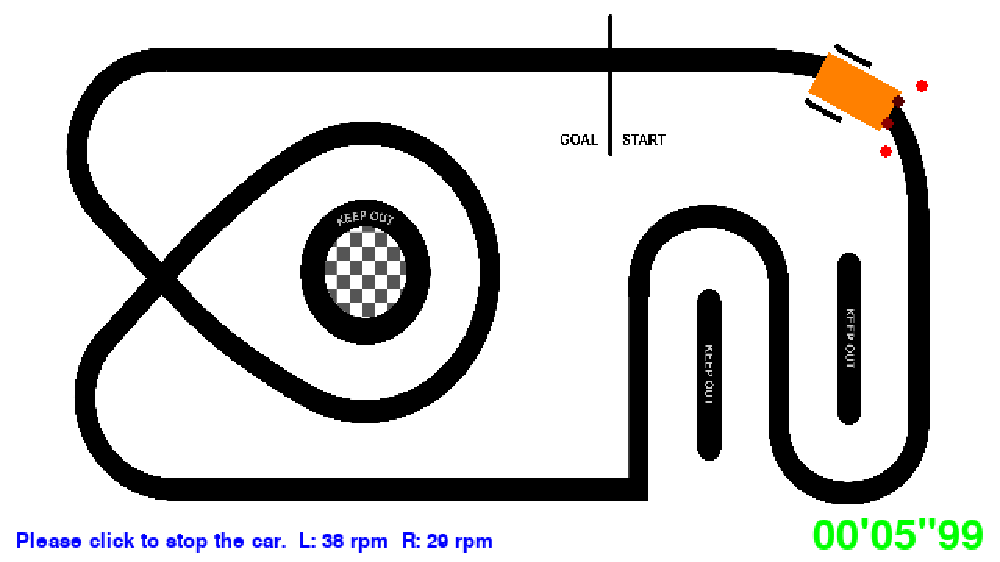

# ライントレース簡易シミュレータ・詳細パラメータモデル（mbd_phs2）

詳細パラメータモデル（車体の重心と車輪間の中心がずれたモデル．DC モータとギヤの特性を含む）に従う
ライントレーサを，pygame の画面上でコースに沿って走らせるシミュレータです。
ロータリーエンコーダによる車輪の回転数の計測を模擬し，走行データを CSV ファイルに保存します。

「電子情報通信設計製図」新潟大学工学部工学科電子情報通信プログラム



同じ物理モデルは，[`mbd_phs3`](../mbd_phs3/README.md)（ROS 2 版）と
[`mbd_phs5`](../mbd_phs5/README.md)（MATLAB/Simulink 版）でも使っています。

## 準備

PC（Windows，WSL2 の Ubuntu）や Raspberry Pi 4/5 で実行します。

Raspberry Pi OS や Ubuntu の場合

```
$ sudo apt-get install python3-pygame python3-transitions python3-numpy python3-scipy
```

Windows で python.org の Python を使う場合

```
> py -m pip install pygame transitions numpy scipy
```

## 実行

```
$ cd ~/EicDesignLab/mbd_phs2
$ python3 main_mils_line_follower.py
```

Windows の場合は `py main_mils_line_follower.py` で実行します。

## 操作

画面の下に，次の操作の案内が表示されます。

1. 車体をマウスでドラッグして，置く位置を決める
2. マウスをクリックしたままドラッグして，車体の向きを決める
3. クリックすると走り始める（[SPACE] キーでも開始）
4. クリックすると止まり，1. に戻る（[ESC] キーでも停止）

[q] キーで終了します。走行中は，ロータリーエンコーダで計測した左右の車輪の回転数 [rpm] が画面の下に表示されます。

## 走行データの保存

走り始めてから止めるまでの走行データが，走行ごとに `lf_sim_日時.csv`（例：`lf_sim_20261007_103000.csv`）に保存されます。
保存しない場合は，`main_mils_line_follower.py` の `LOGGING` を `False` にしてください。

| 列 | 内容 |
|---|---|
| `time_s` | 走行開始からの経過時間 [s] |
| `u_left`，`u_right` | 左右のモータ制御信号 [-1,1] |
| `rpm_left`，`rpm_right` | ロータリーエンコーダで計測した左右の車輪の回転数 [rpm]（回転の向きは区別しない） |
| `rpm_left_true`，`rpm_right_true` | 物理モデルから求めた左右の車輪の回転数（真値）[rpm] |
| `v_mm_s`，`w_rad_s` | 車体の速度 [mm/s] と角速度（左回りが正）[rad/s] |
| `x_mm`，`y_mm`，`theta_rad` | 画面上の車体の位置 [mm] と角度 [rad] |

位置と角度は画面の座標系（x 軸が右，y 軸が下，原点は左上，θ は画面上で時計回りが正）です。
`mbd_phs3`，`mbd_phs5` の CSV は ROS の約束（y 軸が上，長さの単位は m）に従うので，比べるときは注意してください。

## ファイルの構成

| ファイル | 内容 |
|---|---|
| `main_mils_line_follower.py` | シミュレータの本体（コースの読み込み，画面の描画，操作の状態遷移） |
| `mils_line_follower_body.py` | 車体の物理モデル（詳細パラメータモデル） |
| `mils_line_follower_ctrl.py` | 制御則 |
| `mils_line_follower_phrf.py` | フォトリフレクタの模擬 |
| `mils_line_follower_enc.py` | ロータリーエンコーダの模擬（実機用の `rotary_encoder.py` と同じ方法で回転数を算出） |
| `mils_line_follower_log.py` | 走行データの CSV 保存 |

## 変更してみよう

- 制御則：`mils_line_follower_ctrl.py` の `prs2mtrs()`
  （入力はフォトリフレクタの値 [0,1]×4（左から順，白で1，黒で0），出力はモータ制御信号 [-1,1]×2（左，右））
- フォトリフレクタの配置：`mils_line_follower_body.py` の `LF_MOUNT_POS_PRF`
- 物理モデルのパラメータ：`mils_line_follower_body.py` の `PARAMS_*`（摩擦係数，ギヤ比，モータ定数など）．
  ギヤ比 `PARAMS_N` はギヤボックスのタイプに合わせて変更します（ツインモータギヤボックスの A タイプは 58.2，C タイプは 203.7）
- ロータリーエンコーダ：`mils_line_follower_enc.py` の `LFRotaryEncoder` の引数（スリット数，平滑化係数など）
- コース：`main_mils_line_follower.py` の `COURSE_IMG`（`../images` の画像），`COURSE_RES`（解像度 mm/pixel）

## 参考

- `mbd_phs1`（簡略パラメータモデル）：[README](../mbd_phs1/README.md)
- `mbd_phs3`（ROS 2 版）：[README](../mbd_phs3/README.md)
- `mbd_phs4`（Gazebo 版）：[README](../mbd_phs4/README.md)
- `mbd_phs5`（MATLAB/Simulink 版．走行データからの物理モデルの同定もできる）：[README](../mbd_phs5/README.md)
